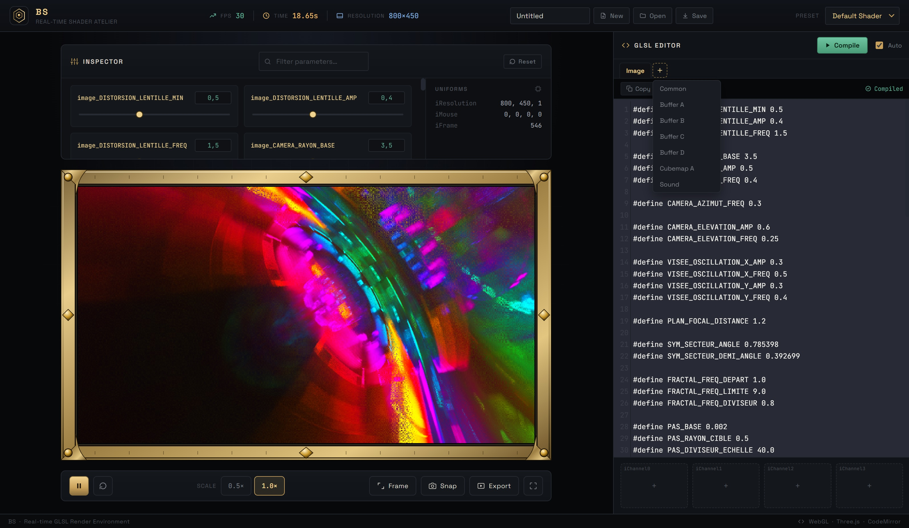

# BS — Shader Studio

A real-time GLSL shader playground in the spirit of [shadertoy.com](https://www.shadertoy.com), built with **Three.js** and **CodeMirror**, running entirely in the browser. Write multi-pass fragment shaders, wire inputs to `iChannel0-3`, tweak `#define` values with live sliders and preview the result instantly — no build step, no backend.



## ✨ Features

**Editor & passes**
- **Live GLSL editor** (CodeMirror) with syntax highlighting, per-pass compile status and an **auto-compile** mode with a short debounce.
- **Multi-pass projects** — tabs for **Common / Image / Buffer A-D / Cubemap A / Sound**, added with the **+** button. Buffers are ping-pong render targets with feedback support (a buffer can read itself); they freeze on pause, are cleared on Reset, and `iFrame == 0` is true on the first frame, like on shadertoy.com.
- **Cubemap A** rendered face by face and sampled as `samplerCube`; **3D volumes** sampled as `sampler3D`.
- **Sound shader** — `vec2 mainSound(int samp, float time)` is rendered offline (60 s at 44.1 kHz) and played through Web Audio, synchronised with the timeline.
- **Errors surfaced inline** — GLSL compiler errors are shown in an error console and as a badge on the failing pass tab.

**Inputs (`iChannel0-3`)**
- **Input picker** in the shadertoy style: Textures, Cubemaps, Volumes, Videos and Music tabs, paginated thumbnail grid.
- **Music** — the tracks in `assets/music/` are exposed as a 512×2 texture (row 0 = spectrum, row 1 = waveform); playback follows the timeline and `iChannelTime` carries the track time.
- **Keyboard** input (256×3 texture: state / pressed / toggle) for projects that use it.
- Built-in textures, cubemaps, volumes and videos are procedurally generated (no third-party media shipped).

**Workflow**
- **Parameter inspector** — `#define` constants are exposed as sliders, with a filter/search box.
- **Uniforms monitor** — `iResolution`, `iMouse`, `iFrame`, … update live.
- **Presets** — Default Shader, Warp Speed, Calm Drift.
- **Projects** — autosaved in the browser (`localStorage`); **New / Open / Save** as a `.bsproject.json` file.
- **Playback controls** — play/pause and reset the timeline; render scale buttons.
- **Screenshot**, **video export** (WebM/MP4, frame by frame) and **fullscreen** preview.
- **Copy / paste** shader code, and an **FPS / time / resolution** HUD in the header.

## 🚀 Getting Started

No installation or build tools required.

1. Clone or download this repository.
2. Serve the `docs/` folder over HTTP(S), for example:
   ```bash
   cd docs
   python3 -m http.server 8000
   ```
   then open <http://localhost:8000/> in a modern desktop browser (Chrome, Edge or Firefox recommended).
3. Edit the GLSL in the editor — the preview updates automatically when **Auto-compile** is on, or click **Compile**.

> Opening `docs/index.html` directly (`file://`) works for everything **except the sound of the Music tracks**, which browsers mute for local files. The GitHub Pages site below has no such limit.

Three.js, CodeMirror and the fonts are loaded from CDNs, so an internet connection is required the first time the page loads.

You can also try it online via GitHub Pages: **[patrickjaillet.github.io/bs](https://patrickjaillet.github.io/bs)**

## 📚 Documentation

- [`docs/README.md`](./docs/README.md) — code structure, script load order, Sound shader, Music, Keyboard, projects.

## 🛠️ Tech Stack

- [Three.js](https://threejs.org/) (r128) — WebGL rendering
- [CodeMirror 5](https://codemirror.net/5/) — in-browser code editor
- Web Audio API — Sound shader playback and Music analysis
- Plain HTML/CSS/JavaScript — no bundler, no framework

## 📄 License

This project is licensed under a proprietary license — all rights reserved. See [LICENSE](./LICENSE) for details.

## 📬 Contact

**Patrick JAILLET**
Email: [sandefjord.development@proton.me](mailto:sandefjord.development@proton.me)
Website: [https://patrickjaillet.github.io/bs](https://patrickjaillet.github.io/bs)
